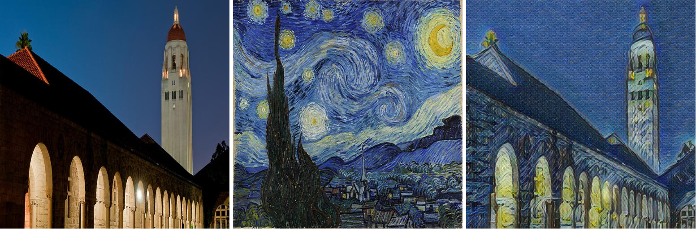
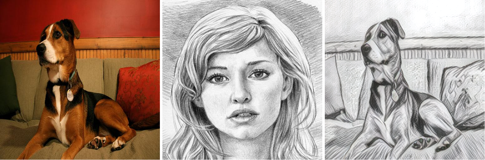
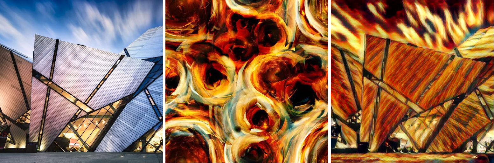
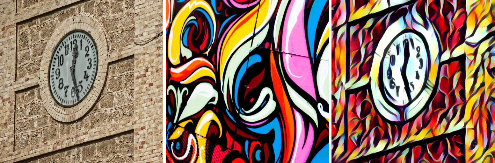

PAMA
================
​		This is the Pytorch implementation of Progressive Attentional Manifold Alignment.
​		1/14/2022 Thanks to github user [AK391](https://github.com/AK391) for making a [web demo](https://huggingface.co/spaces/akhaliq/PAMA) for PAMA.


## Requirements

* python 3.6
* pytorch 1.2.0+
* PIL, numpy, matplotlib

## Checkpoints

Please download the pre-trained checkpoints at [google drive](https://drive.google.com/file/d/1rPB_qnelVVSad6CtadmhRFi0PMI_RKdy/view?usp=sharing) and put them in ./checkpoints. 

Here we also provide some other pre-trained results with different loss weights:

| Type             | Loss            | Download             |
| ---------------- | --------------- | -------------------- |
| high consistency | w/o color loss  | PAMA_consistency.pth |
| high style       | 2x style loss   | PAMA_style.pth       |
| high content     | 2x content loss | PAMA_content.pth     |

The checkpionts will be uploaded recently.

## Training

The training set consists of two parts, the content images from COCO2014 and style images from Wikiart.

```python
python main.py train --lr 1e-4 --content_folder ./COCO2014 --style_folder ./Wikiart
```

## Testing

To test the code, you need to specify the path of the content image and the style image. 

```python
python main.py eval --content ./content/1.jpg --style ./style/1.jpg
```

If you want to do a batch operation for all pictures under the folder at one time, please execute the following code.

```python
python main.py eval --run_folder True --content ./content/ --style ./style/
```


## Results Presentation

​		The results prove the quality of PAMA from three dimensions: Regional Consistency, Content Proservation, Style Quality.  


#### Regional Consistency




#### Content preservation




#### Style Quality





#### Other Results


